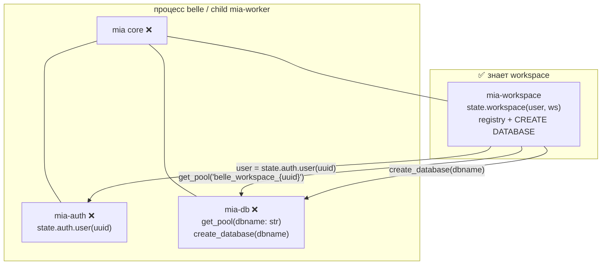
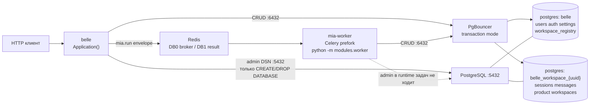

# ADR-003: Именованные пулы и модуль workspace

| Поле | Значение |
|------|----------|
| **Статус** | accepted |
| **Дата** | 2026-08-20 |
| **Автор** | Эна (architect) |
| **Ревью** | Нора (db-architect) — схема; Кира/Лита — сеть/TLS (шаг 3 плана) |
| **Проекты** | belle, mia, mia-db, mia-worker, mia-workspace, mia-auth |
| **Связанные** | ADR-002 v4 (исполнение `@task`). Настоящий ADR **отменяет shaltir** как исполнитель и как владельца пулов. Очередь остаётся Redis / задача `mia.run` / очередь `mia`; процесс — **mia-worker (Celery)**. |
| **План** | `/home/opencode/projects/belle/plan.md` (поправка Мастера обязательна) |
| **Стандарт** | `docs/CODING_STANDARD.md` §3 (инкапсуляция). `docs/ARCHITECTURE_STANDARD.md` в командном `docs/` **нет** — контракт волны фиксируется этим ADR. |

---

## 1. Контекст

Сейчас у mia-db модель «один `ConnectionPool` → одна `DB_NAME`». Пул открывается на старте модуля, `min_size=DB_POOL_MIN`. Это ломается, как только появляются **тысячи** per-user PostgreSQL database.

Факты из кода и плана:

- Системная БД `belle` (users, auth, settings) — одна на инстанс.
- Per-user данные должны жить в отдельных БД `belle_workspace_{uuid}`.
- `DbContextRouter` в Python **нет**. Workspace-схема лежит в **той же** БД, что auth, с `REFERENCES auth.users`.
- Текущий `modules/workspace` ходит в `WorkspaceProvider` через DI. Это **неверный API** относительно контракта Мастера — модуль будет переписан.
- Очередь уже Redis, исполнитель `python -m modules.worker`. Импортов shaltir нет; остаток имени `ShaltirResultHandle`. Контейнер shaltir снят.
- PgBouncer в compose нет. SSL-поля есть в `DatabaseConfig`, в пул не прокинуты.
- Пул воркера создаётся после fork (`worker_process_init`) — это сохранить.

Цель волны: belle и mia-worker обслуживают тысячи named database без исчерпания `max_connections` PostgreSQL и без утечки пулов в prefork Celery.

---

## 2. Решение

Принимаем **четыре связанных решения**. Они неразделимы: пулы без границ модулей снова протекут workspace в ядро.

1. **mia-ядро не знает workspace, сессии, user-БД, shaltir.** Ядро — `Application`, модули, очередь Redis.
2. **mia-db — фабрика именованных пулов.** Системный пул (`DB_NAME=belle`) всегда живой. `get_pool(dbname: str)` — ленивый LRU + idle timeout. Для db имя БД — **просто строка**. db не знает user / workspace / session.
3. **Домен workspace — только модуль `mia-workspace`.** Он задаёт имена БД, владеет реестром, вызывает `db.create_database(dbname)`, отдаёт `state.workspace(...)`.
4. **Снаружи runtime — PgBouncer `pool_mode=transaction`.** Приложение не ходит в postgres напрямую, кроме admin-DSN для `CREATE DATABASE`.

Дополнительно, как инварианты той же волны:

- SSL живёт **только** в mia-db. Worker SSL не дублирует.
- Каскад конфигов: дефолты модуля → `MiaConfig` / `MIA_*` → belle/compose только важное.
- Очередь: Redis. Исполнитель: mia-worker (Celery). shaltir удалён навсегда.
- Пулы только после fork Celery. Parent без открытых соединений. Shutdown закрывает все.
- Transaction mode → prepared statements выключены (`prepare_threshold=None`).
- Бэкенд **не** ставит `Set-Cookie`. Логин отдаёт JSON; фронт (отдельный проект) сам кладёт uuid/login/session в куки.

---

## 3. Кто знает workspace

Это главная ось ADR. Нарушить таблицу = сломать инкапсуляцию.

| Слой | Знает | Не знает |
|------|--------|----------|
| **mia core** | `Application`, модули, очередь Redis, envelope задачи | workspace, сессии, user-БД, shaltir, PgBouncer |
| **mia-db** | DSN, SSL, системный пул, `get_pool(dbname)`, `create_database(dbname)`, LRU по строке | workspace, user, session, Celery |
| **mia-auth** | `User`, `state.auth.user(uuid)` | workspace, пулы, имена user-БД |
| **mia-workspace** | user → dbname, CRUD ws/sessions/messages, `state.workspace(...)`, `workspace_registry` | Celery, PgBouncer, SSL, DSN |
| **mia-worker** | Celery prefork, `worker_process_init` / shutdown, Redis | домен workspace (грузит те же модули, но сам инфра-слой workspace не знает) |
| **belle** | тонкая обёртка `Application()`, HTTP | не дублирует db/workspace логику |
| **PgBouncer** | `belle` + stanza `*` | смысл имён БД |
| **PostgreSQL** | объекты в `belle` и `belle_workspace_{uuid}` | домен |
| **Redis** | broker DB0, result DB1 | workspace |

Имя БД задаёт **модуль workspace**. Паттерн: `belle_workspace_{uuid}`, UUID-only, без username в идентификаторе. uuid в имени — **user id** (одна PostgreSQL database на пользователя). Продуктовый workspace (папка/пространство) живёт **внутри** этой БД и **не** создаёт новую PostgreSQL database.



`workspace_id` **не** является полем ядра и **не** является API mia-db. Если задаче на воркере нужен контекст БД — это аргументы задачи модуля workspace, не envelope ядра.

---

## 4. Runtime



Кто на этой схеме знает workspace: **только модуль `mia-workspace`**, загруженный в процесс belle и в child воркера. Стрелки к PgBouncer/Redis/postgres workspace не знают.

Исключение admin-DSN: `CREATE DATABASE` нельзя надёжно гнать через PgBouncer transaction mode. Workspace вызывает `db.create_database(dbname)`; db открывает короткий autocommit-коннект в `postgres:5432` (не в target db). CRUD после создания — только через `:6432`.

---

## 5. mia-db: фабрика именованных пулов

### 5.1. Контракт

Публичный контракт модуля (имена из домена **database**, не workspace):

- `get_system_pool() -> ConnectionPool` — пул системной БД (`DB_NAME=belle`). Always-on: `open=True`, `min_size=pool_min`, `max_size=pool_max`.
- `get_pool(dbname: str) -> ConnectionPool` — именованный пул. Ленивый LRU + idle timeout. Для системного имени возвращает системный пул, не второй экземпляр.
- `create_database(dbname: str, *, template: str | None = None) -> None` — admin-DSN, `psycopg.sql.Identifier`, autocommit. Не знает, зачем эта БД.
- `drop_database(dbname: str) -> None` — тот же admin-путь. Явный вызов, не крючок на удаление пользователя в этой волне.
- `close_all()` — закрыть системный и все LRU.
- Опционально: `use_database(dbname: str)` — context manager на `contextvars` с **opaque dbname**. Не `use_workspace`.

db **валидирует** dbname как безопасный SQL-идентификатор (алфавит `[a-z0-9_]`). Паттерн `belle_workspace_` и UUID проверяет **workspace**, не db.

Поля конфига **без слова workspace**:

| Поле | Дефолт | Смысл |
|------|--------|--------|
| `pool_min` / `pool_max` | `1` / `2` | системный пул |
| `named_pool_min` / `named_pool_max` | `0` / `1` | named LRU; min=0 = lazy connect |
| `named_lru_size` | `32` | cap на процесс |
| `named_idle_timeout` | `60` | секунды |
| `prepared_statements` | `False` | PgBouncer transaction |
| `ssl_mode` / `ssl_ca` / cert / key | как сейчас | **единственное** место SSL |
| `admin_host` / `admin_port` | `None` → fallback на host/port | только DDL CREATE/DROP |

ENV модуля: `DB_POOL_*`, `DB_NAMED_POOL_MIN`, `DB_NAMED_POOL_MAX`, `DB_NAMED_LRU_SIZE`, `DB_NAMED_IDLE_TIMEOUT`, `DB_SSL_MODE`, `DB_ADMIN_HOST`, `DB_ADMIN_PORT`. Не `DB_WS_*` — иначе db знает домен workspace.

`provider._pool` для обратной совместимости = системный пул. Методы, которым нужна другая БД, берут `get_pool(dbname)`.

### 5.2. LRU

- Не открывать N пулов на старте. После старта: 1 системный, 0 named.
- Hit: move-to-end, `last_used=now`.
- Miss: singleflight на dbname; если cap достигнут — evict idle / LRU victim **только если нет checked-out**.
- Если некого выселить — **не** создавать (cap+1)-й. Ошибка `PoolCacheFull` → retry на уровне задачи. Безлимитный рост запрещён.
- Janitor (daemon, ~10s) закрывает idle > timeout.
- Pid-guard: у каждого пула `pid`; если `os.getpid() != pid` — не использовать, пересоздать (страховка от fd после ошибочного open до fork).

### 5.3. Prepared statements

На **всех** пулах `prepare_threshold=None`. `LISTEN`, temp tables и session-state в CRUD через эти пулы запрещены: transaction mode мультиплексирует серверные коннекты.

---

## 6. mia-workspace: домен и контракт

Текущий `modules/workspace` (схема в общей `belle` + `WorkspaceProvider` DI + FK на `auth.users`) **неверный**. Переписывается под контракт Мастера.

### 6.1. API

```
state.workspace(user=uuid|User, ws=uuid)          → объект одного workspace
state.workspace(user=...).list()                  → JSON список workspace пользователя
state.workspace(user=..., ws=...).sessions()      → JSON список сессий
state.workspace(user=..., ws=...).sessions(sid)   → JSON лента: сообщения + действия вперемешку
```

`user` можно передать как `state.auth.user('uuid')`. Модуль workspace зависит от auth **на уровне User**, не на уровне FK.

### 6.2. Данные

| Где | Что | Чего нет |
|-----|-----|----------|
| Системная БД `belle` | таблица модуля `workspace_registry`: `id`, `user_id UUID`, `db_name TEXT UNIQUE`, `status`, `created_at`, `dropped_at` | FK на `auth.users` (даже будучи в той же БД — модули не склеиваем схемой) |
| User-БД `belle_workspace_{uuid}` | продуктовые workspaces, sessions, messages, действия ленты | FK на `auth.users`, знания об auth |

`user_id` / `owner_id` в user-БД — UUID без cross-db FK. Целостность прикладная: provision после insert user.

Провижининг (владелец — workspace, примитив — db):

1. Запись в `workspace_registry`.
2. `db.create_database("belle_workspace_{uuid}", template="template_workspace")`.
3. Идемпотентность: если `db_name` уже в registry — не создавать повторно.

Продуктовый `create_workspace` (папка внутри user-БД) **не** вызывает `CREATE DATABASE`.

`template_workspace`: один раз создать, дальше только `CREATE DATABASE ... TEMPLATE`. К template не должно быть открытых сессий в момент CREATE. Точный SQL — Нора, шаг 2 плана. Этот ADR фиксирует **границу**, не колонки.

### 6.3. Связь с пулами

Workspace резолвит `user` → `dbname` → `db.get_pool(dbname)`. Роутер с именем `workspace_id` в mia-db **не появляется**.

---

## 7. Формула соединений

Обязательна к соблюдению. Без PgBouncer формула убивает postgres за минуты.

```
P     = belle_процессы + celery_concurrency          # 1 + CPU, на ai-t-01 ≈ 9
S_max = system pool max на процесс                   # дефолт 2
L     = LRU cap named-пулов на процесс               # дефолт 32
K     = max_size одного named-пула                   # дефолт 1
C     = P * (S_max + L * K)                          # клиенты → PgBouncer
                                                     # 9 * (2 + 32) = 306

max_client_conn(PgBouncer) ≥ C * 1.5                 # → 1000
server_conns ≈ default_pool_size * (1 system + N_active_named_dbs)
postgres max_connections ≥ server_conns + 3 (superuser)
```

При 20 активных пользователях и `default_pool_size=5`: `20*5 + ~20 ≈ 120` серверных соединений. При 1000 пользователях, но 20 активных — то же самое. LRU + idle timeout + `server_idle_timeout` держат хвост мёртвым.

Старт `max_connections` на ai-t-01: **200** (не 100 и не 10000). Точную цифру считает Нора.

---

## 8. PgBouncer, SSL, сеть

### 8.1. PgBouncer

Отдельный стек рядом с postgres (`~/app/pgbouncer` или `~/app/postgres`), **не** свалка в belle-compose. В belle-compose — `DB_HOST=pgbouncer`, `DB_PORT=6432`.

```
pool_mode = transaction
listen_port = 6432
max_client_conn = 1000
default_pool_size = 5
min_pool_size = 0
reserve_pool_size = 2
server_idle_timeout = 60
server_lifetime = 3600
query_wait_timeout = 30
ignore_startup_parameters = extra_float_digits,options
auth_type = scram-sha-256
[databases]
belle = host=postgres port=5432 dbname=belle
* = host=postgres port=5432
```

Stanza `*` обязательна: тысячи `belle_workspace_{uuid}` нельзя перечислять руками.

Порты: `5432` только для pgbouncer + admin provisioner. Приложение снаружи видит `6432`.

### 8.2. SSL

SSL — **только mia-db** (`DB_SSL_MODE`, CA в образе belle). `grep SSL modules/worker` = 0.

Рекомендация (подтверждает шаг 3, Кира+Лита):

- На `app-net`: клиент belle/worker → pgbouncer **без TLS** (`DB_SSL_MODE=disable`).
- PgBouncer → postgres **с TLS** (`server_tls_sslmode=require`, CA как у postgres).
- Не ставить `sslmode=prefer` молча.

Альтернатива, если Мастер потребует TLS до pgbouncer: `client_tls_sslmode=require` + сертификат pgbouncer, тот же `DB_SSL_MODE=require`, без новых переменных в worker. Два пути сразу не держим.

### 8.3. Роли

Две роли PostgreSQL:

- CRUD-роль приложения: `CONNECT` на user-БД, **без** `CREATEDB`.
- Admin-роль provisioner: только для `create_database` / `drop_database`.

`CREATEDB` у CRUD-роли запрещён: injection в идентификатор не должен создавать БД.

---

## 9. Celery × пулы

```
parent celery (не грузит db, нет открытых соединений)
  fork × CPU
    child: worker_process_init
      Application(...)
      DatabaseModule.on_load → PoolManager.start()  # pid-guard
    child: задача модуля workspace
      dbname = f"belle_workspace_{user_uuid}"
      db.get_pool(dbname)
    child: worker_process_shutdown / max_tasks_per_child
      PoolManager.close_all()
```

- Prefork остаётся. Не threads/gevent в этой волне.
- `PoolManager` не шарить между процессами через memory.
- `max_tasks_per_child=1000` — recycle без зависших коннектов старого PID.
- Остаток `ShaltirResultHandle` → `TaskResultHandle`. В runtime-коде имени shaltir нет.

Ядро **не** добавляет `workspace_id` в envelope. Модуль workspace передаёт нужное в аргументах своей задачи.

---

## 10. Каскад конфигов

Порядок (последний побеждает), как у `WorkerConfig`:

```
1. Дефолты модуля
2. MiaConfig / MIA_*
3. Belle / compose ENV — только важное
```

В compose **класть:** `REDIS_*`, `DB_HOST=pgbouncer`, `DB_PORT=6432`, `DB_NAME=belle`, `DB_USER` / `DB_PASSWORD`, `DB_SSL_MODE`, `DB_ADMIN_HOST=postgres`, `DB_ADMIN_PORT=5432`, `SERVICE_NAME`, `PYTHONPATH`.

В compose **не класть:** `DB_POOL_*`, `DB_NAMED_*`, `WORKER_PREFETCH`, `WORKER_BROKER_DB`, `WORKER_CONCURRENCY` (пусто = CPU), пути к CA (CA в образе).

В `MiaConfig` — overlay `db.pool_*` / `db.named_*`. Хост, пароль, SSL в MiaConfig **нет**. Пароль не в `public_dict` / логах (`CODING_STANDARD`).

---

## 11. Очередь

- Broker: Redis DB0. Result: Redis DB1.
- Задача: `mia.run`. Очередь: `mia`.
- Исполнитель: `python -m modules.worker` (тот же образ, что belle).
- shaltir: репо, контейнер, импорты, брокер-обёртка, пулы — **не возвращать**.

Это меняет исполнителя из ADR-002 v4, не контракт Redis.

---

## 12. Куки и идентичность

Бэкенд — JSON API. Фронт — **отдельный проект**.

- Логин отвечает JSON (uuid / login / session — как решит контракт auth). **Без** `Set-Cookie`.
- Фронт сам кладёт uuid/login/session в куки.
- Бэкенд **может читать** входящий `Cookie` / заголовок, но **не пишет** Set-Cookie.
- `state.workspace(user=...)` получает User из auth, не из cookie-логики ядра и не из db.

Связь с этой волной: идентичность пользователя — вход в workspace-модуль. Смешивать сессию HTTP с пулами и Set-Cookie на API — запрещено.

---

## 13. Обоснование

| Решение | Почему | Что было бы хуже |
|---------|--------|------------------|
| Workspace — модуль, не ядро | Домен (user, ws, sessions, лента) не должен протекать в `Application` и в db. Иначе любой новый модуль тащит workspace | Ядро знает user-БД → нельзя переиспользовать mia-db в другом продукте |
| db = фабрика по `dbname: str` | Пул — инфраструктура. Имя БД — решение модуля, который эту БД завёл | `get_workspace_pool(uuid)` в db = db знает workspace |
| Отдельная PostgreSQL database на user | Изоляция дампа/drop, нет shared catalog noise, нет «один SELECT без WHERE = все» | См. альтернативы §14 |
| Одна PG-БД на user, не на продуктовый ws | Тысячи папок не должны давать тысячи `CREATE DATABASE`. Product ws — строки в user-БД | Взрыв БД при каждом «новом пространстве» |
| LRU + idle, не «все пулы навсегда» | Формула `C`; 1000 users × P × K без cap убивает RAM/FD даже с PgBouncer | §14.3 |
| PgBouncer transaction | Мультиплекс тысяч клиентских коннектов в десятки серверных | Прямой postgres: смерть `max_connections` |
| Admin-DSN в обход | `CREATE DATABASE` + template lock не живут в transaction pooling | Provision через :6432 — гонки и «БД нет в `*`» |
| SSL только в mia-db | Один источник истины; воркер — тот же код db | Двойной TLS/CA в worker, уже обжигались на `prefer` |
| Пулы после fork | async/psycopg pool в parent → дети делят fd → «another command is already in progress» | Open до fork |
| Prepared off | Transaction mode рвёт session-уровень prepare | `prepared statement already exists` |
| Redis + mia-worker, не shaltir | shaltir снят; очередь уже Redis; второй брокер-слой — мёртвый код | §14.4 |
| JSON-логин, куки на фронте | Сплит фронт/бэк, CLI/внешние клиенты, нет CSRF-связки домена API | §14.5 |
| Имена конфига без `workspace` в db | Иначе инвариант «db не знает workspace» лжёт уже в ENV | `DB_WS_*` как контракт db |

---

## 14. Отклонённые альтернативы

### 14.1. Схемы вместо БД (`CREATE SCHEMA per user` в одной `belle`)

**Отклонено.**

Плюсы, которые соблазняют: один пул, нет `CREATE DATABASE`, нет PgBouncer `*`, проще миграции.

Минусы, из-за которых нельзя:

- Изоляция слабая: общий catalog, общие locks, `search_path` легко выставить неправильно.
- Дамп/restore/drop одного пользователя — боль (`pg_dump -n`), не `DROP DATABASE`.
- Noisy neighbor по autovacuum и DDL.
- Утечка `search_path` = данные чужого пользователя в том же коннекте.
- Не бьётся с целью «тысячи изолированных user-store».

Отдельная БД даёт настоящий drop, настоящий dump и настоящий `CONNECT` grant. Цена — named pools + PgBouncer — принимается этим ADR.

### 14.2. RLS вместо отдельных БД

**Отклонено.** Явно вне волны (`plan.md` §7).

Row Level Security в одной таблице на всех:

- Один баг в политике / один запрос от superuser-роли = все пользователи.
- Политики молча фильтруют; тесты это плохо ловят.
- Нельзя выдать/забрать БД целиком, нельзя независимо бэкапить.
- Per-user PostgreSQL roles + RLS — операционный ад на тысячах пользователей.

Изоляция данных — граница database, не `USING (user_id = current_setting(...))`.

### 14.3. Пул на каждую БД навсегда

**Отклонено.**

Вариант «на старте открыть пул на каждую строку `workspace_registry`» или «открыл — живёт вечно»:

- Старт при 1000 users × P процессов = тысячи пулов, большинство мёртвые.
- Даже `max_size=1` ест FD и клиентские слоты PgBouncer (`C = P * (S_max + N * K)` без LRU cap).
- Нет idle timeout → postgres/`server_idle_timeout` не спасает клиентскую сторону.

Ленивый LRU + жёсткий cap + запрет создавать сверх cap — единственный способ, которым формула §7 остаётся правдой.

### 14.4. Пулы shaltir / возврат shaltir

**Отклонено.**

shaltir был тонкой обвязкой Celery + свой sync pool (`worker_process_init`, pid-guard). Это **снято**: контейнер нет, импортов нет, ADR-002 v4 в части исполнителя отменяется.

Возвращать shaltir-пулы = два владельца соединений (shaltir и mia-db), два каскада конфигов, снова имя, которое Мастер вычеркнул. Пулы принадлежат **mia-db**. Очередь — Redis. Исполнитель — mia-worker. Pid-guard и «open только после fork» переезжают в mia-db, не в отдельный пакет.

### 14.5. Куки на бэке (`Set-Cookie`)

**Отклонено.**

Бэкенд, который ставит сессионную куку:

- Привязывает API к домену/path/SameSite фронта, которого в этом репо нет.
- Ломает CLI и внешних клиентов (им JSON, не браузерная сессия).
- Смешивает HTTP-сессию с идентичностью, которую workspace берёт как `User`.

Логин отдаёт JSON. Фронт сам кладёт uuid/login/session в куки. Бэкенд не пишет `Set-Cookie`.

### 14.6. Прочее, что тоже нет

| Идея | Почему нет |
|------|------------|
| Прямой postgres без PgBouncer | Формула §7, риск 5.1 плана |
| `pool_mode=session`, чтобы жил prepare | Теряем мультиплекс; prepared выключаем, session не нужен |
| Предсоздание пулов по всему registry | = §14.3 |
| `workspace_id` в envelope ядра | Ядро узнаёт workspace |
| `DbContextRouter.use_workspace` в mia-db | db узнаёт workspace; замена — `get_pool(dbname)` / `use_database(dbname)` |
| Cross-db FK / `REFERENCES auth.users` в user-БД | PostgreSQL так не умеет; даже в system registry FK клеит модули |
| Дублировать SSL в worker | Два CA, два `sslmode`, регресс `prefer` |
| asyncpg / event loop в db | Стек sync psycopg; Celery prefork |

---

## 15. Последствия

### Положительные

- mia-db переиспользуем: любой модуль может завести named database, не только workspace.
- Тысячи user-БД не держат тысячи серверных коннектов, если активных мало.
- Ядро остаётся слепым к домену чатов/сессий.
- shaltir не возвращается «через пулы».

### Отрицательные / цена

- Нужен PgBouncer и admin-путь. Два хоста: `pgbouncer:6432` и `postgres:5432`.
- Prepared statements нельзя включить, пока transaction mode.
- Provision зависит от `template_workspace` без активных сессий.
- Текущий `modules/workspace` ломаем и переписываем — это не рефакторинг провайдера, это смена API.
- Исторические sessions в общей `belle` этим ADR **не** мигрируются (отдельный ETL, вне волны).

### Для реализации (не код этого ADR)

Сона не пишет модули, пока этот ADR accepted — теперь он accepted. Границы, которые нельзя нарушить в коде:

- В `mia/modules/db` нет символов `workspace`, `user`, `session` в публичном API.
- В `mia/core` нет `workspace_id`.
- Имя БД собирает workspace после валидации UUID.
- Worker не содержит SSL-конфига.

---

## 16. Риски

| # | Риск | Митигация |
|---|------|-----------|
| 1 | Забыть PgBouncer, ткнуть пулы в `:5432` | CRUD только 6432; формула в этом ADR; алерт exhaustion |
| 2 | Open пула до fork | db грузится в `worker_process_init`; pid-guard; parent без соединений |
| 3 | TLS belle↔pgbouncer сломает текущий `verify-full` | Один путь, шаг 3 Кира/Лита; не `prefer` |
| 4 | LRU skip всех busy → рост без cap | Запрет создавать сверх cap; `PoolCacheFull`; метрика `named_pools_cached` **без** per-db label |
| 5 | `CREATE DATABASE` через transaction pooling | admin-DSN, autocommit, не держать коннекты к template |
| 6 | Prepared / session state | `prepare_threshold=None` на всех пулах |
| 7 | `REFERENCES auth.users` останется в schema | Нора, шаг 2; тест «в schema нет REFERENCES auth» |
| 8 | Кардиналити метрик `db=belle_workspace_{uuid}` | Агрегаты `kind=system\|named`, без per-db label |
| 9 | CRUD-роль с `CREATEDB` | две роли, Лита шаг 14 |
| 10 | Локальные правки mia-db не попадут в образ (Dockerfile клонит GitHub) | порядок мержа: mia-db → mia → mia-worker → belle `CACHEBUST` |

---

## 17. Вне этой волны

Не возвращаем shaltir. Не пишем код «заодно» с ADR. Не дублируем SSL в worker. Не кладём рычаги пулов в compose. Не RLS и не per-user schemas. Не read-replicas. Не asyncpg. Не авто-`DROP DATABASE` на удаление пользователя. Не ETL исторических sessions. Не K8s. Не смена Celery на threads/gevent. Не `pool_mode=session`. Не предсоздание пулов по registry.

Сеть/TLS финально подтверждает шаг 3. Колонки схем — шаг 2 Норы.

---

## 18. Открытые вопросы

Не блокеры ADR (статус accepted), но их надо закрыть до деплоя:

1. **TLS belle/worker → pgbouncer:** рекомендация `disable` на `app-net`. Кира+Лита подтверждают или Мастер требует client TLS. Два пути сразу не живут.
2. **Точный `max_connections` postgres** на ai-t-01 — Нора по формуле §7; старт 200.
3. **Нужен ли позже opaque `dbname` в envelope** для задач чужих модулей, которые пишут в user-БД, не вызывая workspace? Сейчас — нет, пишут через workspace. Если появится — это hint `dbname: str` в dispatch, **не** `workspace_id`.
4. Вынос контракта в командный `docs/ARCHITECTURE_STANDARD.md` / DATABASE standard — после приёмки волны, с Афиной. Сейчас источник истины — этот файл.

---

## 19. Критерии, по которым ADR выполнен в коде (приёмка волны)

1. В belle и в каждом child mia-worker: один живой system pool, ноль named сразу после старта.
2. `get_pool(dbname)` после первого запроса: не более одного пула на это имя на процесс; после idle — evict.
3. LRU overflow не растёт безлимитно.
4. `CREATE DATABASE` → `postgres:5432`; SELECT/INSERT сессий → `pgbouncer:6432` в `belle_workspace_{uuid}`.
5. SSL не описан в worker.
6. `grep -ri shaltir` в runtime mia/belle (кроме changelog/этого ADR) = 0. Класс `TaskResultHandle`.
7. Compose belle без knobs пулов.
8. Бэкенд логина без `Set-Cookie`.
9. Публичный API db без слова workspace. Публичный API ядра без workspace.
10. `state.workspace(...)` — контракт §6.1, не `WorkspaceProvider` DI в общей БД.
