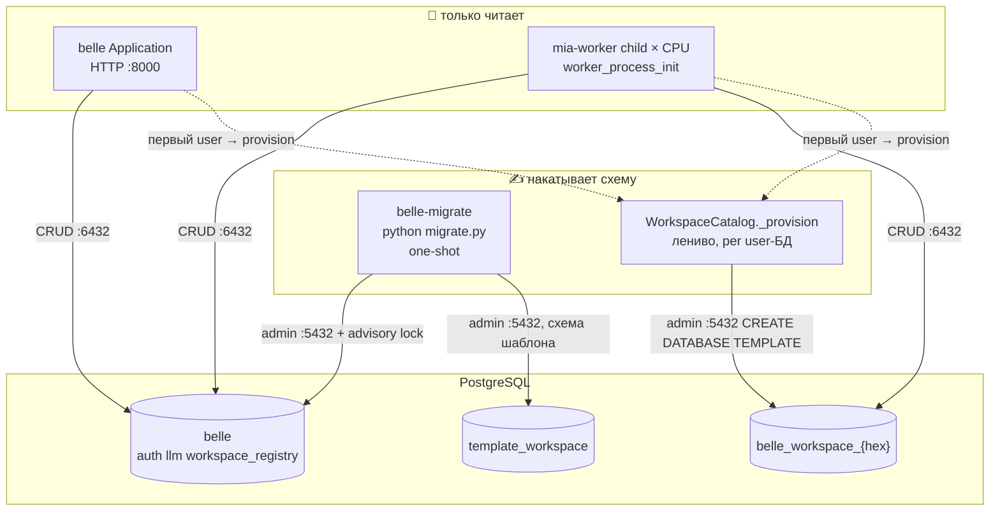
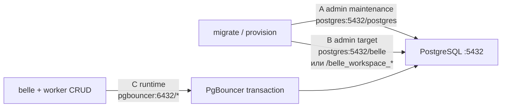

# ADR-004: Накат схем один раз — не в Celery fork

| Поле | Значение |
|------|----------|
| **Статус** | accepted |
| **Дата** | 2026-08-20 |
| **Автор** | Эна (architect) |
| **Ревью** | Афина (направление), Нора (DSN/lock), Рэй (compose entrypoint) |
| **Проекты** | belle, mia, mia-db, mia-auth, mia-workspace, mia-worker, mia-llm |
| **Связанные** | ADR-003 (named pools, admin-DSN, PgBouncer). Очередь `mia.run` **не** используется для DDL. shaltir не возвращается. |
| **План** | этот ADR §12; указатель в `/home/opencode/projects/belle/plan.md` |
| **Код не в этом ADR** | Сона не пишет, пока статус не accepted |

---

## 1. Контекст

Сейчас схема живёт в `on_load`. Это одна процедура и для API, и для каждого Celery-ребёнка.

Факты из кода (2026-08-20):

| Кто | Что делает при старте |
|-----|------------------------|
| **belle** `BelleApp.start()` | `load_module("db")` + `load_module("auth")` |
| **auth.on_load** | `register_schema("auth", DB_SCHEMA)` → `CREATE SCHEMA/TABLE IF NOT EXISTS` + `initialize_sync()` → upsert permissions/roles и **DELETE + INSERT** `auth.role_permissions` |
| **llm.on_load** | то же: `register_schema` + `AuthSchemaRegistry.register_sync` + seed агентов |
| **workspace.on_load** | Python-фасад `state.workspace`; user-схему **не** накатывает |
| **workspace первый `state.workspace(user=...)`** | `CREATE DATABASE` admin-DSN + `register_schema` на named pool |
| **belle-worker child** | `worker_process_init` → `Application.load_all_modules()` → снова `on_load` db/auth |
| **concurrency** | CPU, на ai-t-01 ≈ 8 → **8 одинаковых накатов** плюс belle |

Дублей строк в `permissions`/`roles` нет (`ON CONFLICT`). Гонка есть: `DELETE FROM auth.role_permissions WHERE role_id = %s` без кластерного лока. `max_tasks_per_child` пересоздаёт детей — накат повторяется.

`register_schema` ходит в **runtime-пул** (`DB_HOST=pgbouncer:6432`). Session-level `pg_advisory_lock` через transaction pooling **не работает**: лок остаётся на чужом backend после возврата коннекта в пул.

Мастер отклонил: belle ждёт воркеры и накатывает схему задачей `mia.run`. Курица-яйцо, API не должен падать без Celery.

Направление Афины: DDL один раз под lock в belle **или** `migrate` entrypoint; воркеры только Python + пулы.

---

## 2. Решение

Принимаем **четыре связанных решения**.

1. **Владелец системного наката — one-shot `migrate`, не процесс belle и не child воркера.** Тот же образ, отдельный entrypoint. Compose: `migrate` завершился успешно → потом стартуют belle и worker **независимо друг от друга**.
2. **`on_load` больше не трогает DDL.** Python-загрузка и накат схемы — два метода. Воркеры вызывают только загрузку.
3. **Кластерный лок — `pg_advisory_lock` на admin-DSN (`postgres:5432`), не через PgBouncer.** Session-lock держит выделенный коннект до конца наката.
4. **Workspace user-БД остаётся ленивой.** `CREATE DATABASE` + схема на `belle_workspace_{hex}` — в момент первого `state.workspace(user=...)`, под **отдельным** локом на имя БД. Системная `belle` (auth, llm, registry) — только migrate.

Инварианты ADR-003 не трогаем: ядро не знает workspace; db = `get_pool(dbname)`; CRUD через `:6432`; `CREATE DATABASE` через `:5432`; shaltir нет; бэкенд не пишет `Set-Cookie`.

---

## 3. Кто накатывает, кто только читает



| Процесс | Python `on_load` | Системный DDL `apply_schema` | User-БД provision |
|---------|------------------|------------------------------|-------------------|
| **migrate** | да | **да, один раз, под lock** | нет (только обновляет `template_workspace`) |
| **belle** | да | нет | да, если первый заход в user с API |
| **worker parent** | нет (нет открытых коннектов) | нет | нет |
| **worker child** | да (пулы после fork) | **нет** | да, если первый заход в user с задачи |

Belle **не** зависит от worker. Worker **не** зависит от belle. Оба зависят от **завершённого migrate** и от healthy pgbouncer/redis.

---

## 4. Два метода на модуле — не флаг «я воркер»

### 4.1. Контракт `ModuleBase`

```
on_load(state)       — всегда: DI, пулы, фасады, подписки. Без DDL, без seed.
apply_schema(state)  — опционально, default no-op: register_schema + auth seed + прочий DML схемы.
```

`ModuleManager.load()` вызывает **только** `on_load`. Как сейчас по графу `meta.dependencies`.

`Application.apply_schemas()` — отдельный проход в том же topo-порядке: для каждого загруженного модуля, если `apply_schema` не no-op — вызвать.

Воркеры `apply_schemas()` **не вызывают**. Точка: `worker_process_init` в `core/dispatch/tasks.py`.

### 4.2. Почему не `skip_ddl_on_worker` на модуле

Флаг на `AuthModule` / `LLMModule` («на воркере DDL пропускать») утекает **Celery в домен модуля**. mia-db и mia-auth не знают воркер (ADR-003 §3). Роль процесса — у Composition Root, не у модуля.

Роль задаёт **entrypoint**, не модуль:

| Entry | Роль | `on_load` | `apply_schemas` |
|-------|------|-----------|-----------------|
| `python main.py` | api | да | нет |
| `python -m modules.worker` | worker | да, в child после fork | нет |
| `python migrate.py` | migrate | да | да, под lock |

Dev-исключение: `MIA_SCHEMA_APPLY=on_start` на belle — вызвать `apply_schemas` после load, тоже под lock. На проде переменная не задана. Забытый migrate → belle/worker стартуют, первый запрос в несуществующую таблицу падает явно, `/health` может проверить «есть `auth.users`» и отдать 503. Это зависимость от **postgres**, не от Celery.

### 4.3. Что переезжает из текущих `on_load`

| Модуль | Остаётся в `on_load` | Уходит в `apply_schema` |
|--------|----------------------|-------------------------|
| **db** | `PoolManager.start()`, provider, DI | `_load_procedures()` если это DDL; иначе оставить no-op |
| **auth** | AuthProvider, DI, кеш | `register_schema("auth", …)` + `initialize_sync()` |
| **llm** | LLMProvider, DI, реестр провайдеров | `register_schema("llm", …)` + `register_sync` + `seed_system_agents_sync` |
| **workspace** | `state.workspace = WorkspaceAccessor` | схема **шаблона** `template_workspace` + permissions в auth; **не** user-БД |
| **worker / log / apiproxy / cli / notifications / sample** | как сейчас | no-op |

Auth seed (`DELETE` + `INSERT` `role_permissions`) выполняется **один раз** под тем же lock. Защита в глубину (не этот ADR кодом): seed сделать аддитивным UPSERT без DELETE — тогда повтор migrate безопаснее.

---

## 5. Auth (системная `belle`) vs workspace (user-БД)

Это разные агрегаты. Смешивать в одном `on_load` нельзя.

### 5.1. Системная БД `belle`

Владелец наката: **migrate**.

Состав (порядок = topo модулей: log → db → auth → …):

1. `auth`: PostgreSQL-схема `auth.*`, `_applied_ddl`, файлы `modules/auth/ddl/*.sql`, `AUTH_CORE_SCHEMA`.
2. `llm`: схема `llm.*`, `LLM_SCHEMA` в auth, seed агентов.
3. `workspace.apply_schema`: если появится `workspace_registry` в `belle` — сюда; плюс накат **шаблона** `template_workspace` (не user-БД).

CRUD после migrate: belle и worker через `pgbouncer:6432`, системный пул.

### 5.2. User-БД `belle_workspace_{hex}`

Владелец наката: **ленивый provision** в `WorkspaceCatalog` (модуль workspace, не ядро, не db).

Порядок:

1. Advisory lock по `dbname` на admin-коннекте к существующей БД (`belle` или maintenance `postgres`) — user-БД может ещё не существовать, лок на ней не взять.
2. `CREATE DATABASE … TEMPLATE template_workspace` через admin-DSN (`postgres:5432`). Идемпотентность: duplicate `42P04` → ок.
3. Если шаблона нет (dev без migrate) — fallback: `register_schema` **на admin-коннекте к новой БД**, не через PgBouncer.
4. Если шаблон был — `register_schema` в runtime **не вызывать**. Шаблон уже несёт таблицы/DDL. Это цель ADR-003 / plan.md шаг 6: «миграции user-БД идут через template, не через register_schema на каждую БД в runtime».
5. Unlock. Дальше CRUD: `get_pool(dbname)` → `:6432`.

Threading-lock в `_ensure` остаётся (singleflight в процессе). Он **не** заменяет advisory lock: 8 детей + belle не делят `threading.Lock`.

Ядро по-прежнему не знает workspace. db по-прежнему получает `dbname: str` и `create_database(dbname)`.

---

## 6. DSN: что куда

Три контура. Не два.



| Контур | DSN | Кто | Операции |
|--------|-----|-----|----------|
| **A. maintenance** | `DB_ADMIN_HOST:5432` / БД `postgres` | `PoolManager.create_database` / `drop_database` | `CREATE/DROP DATABASE` |
| **B. admin target** | тот же хост/порт, **dbname = целевая БД** (`belle` или user-БД) | SchemaApplicator, fallback schema на новой БД, advisory lock | `CREATE SCHEMA/TABLE`, ddl/*.sql, seed |
| **C. runtime** | `DB_HOST=pgbouncer:6432` / та же dbname | belle, worker child, CRUD фасада | SELECT/INSERT/UPDATE. **Не DDL, не session lock** |

Сейчас `DatabaseConfig.get_admin_dsn()` всегда бьёт в maintenance `postgres`. Для контура B нужен `get_admin_dsn(dbname: str)` — admin host/port, но **указанная** БД. Публичный API db без слова workspace: это просто dbname.

Почему DDL не через C:

- `pg_advisory_lock` (session) переживает checkout в transaction pooling и «залипает» на случайном backend.
- `pg_advisory_xact_lock` требует одной транзакции на весь накат — ломает будущий `CREATE INDEX CONCURRENTLY` и `CREATE DATABASE`.
- PgBouncer `*` не обязан иметь stanza в момент `CREATE DATABASE` (гонка «БД ещё нет в pool»).

`pg_advisory_lock` берётся **на том же admin-коннекте**, что держится до конца `apply_schemas`. Autocommit на этом коннекте допустим: session-lock не привязан к транзакции.

Ключи:

- Система: `pg_advisory_lock(hashtext('mia.schema.system'))` на контуре B к `belle`.
- Provision user-БД: `pg_advisory_lock(hashtext('mia.schema.' || dbname))` на контуре A или B к `belle` (БД, которая точно есть).

Advisory locks в PostgreSQL **per-database**. Лок, взятый в `postgres`, не виден коннектам к `belle`. Поэтому системный лок — обязательно на `belle`.

---

## 7. Entrypoint migrate

Один процесс, тот же образ, что belle/worker.

```
python migrate.py
  Application(dispatcher=LocalInvokeDispatcher(), allowed_modules=<все с apply_schema>)
  load_all_modules()          # только on_load
  with_system_schema_lock():  # admin target → belle
      apply_schemas()         # topo
  exit 0
```

- Не Celery, не `mia.run`, не Redis.
- `LocalInvoke` — чтобы внутри migrate `@task` на провайдере не уходил в пустую очередь.
- Compose: сервис `migrate`, `restart: "no"` / `restart_policy: none`. `belle` и `worker`: `depends_on: migrate: condition: service_completed_successfully`. **Не** `belle depends_on worker` и не наоборот.
- `depends_on` migrate не требует healthy pgbouncer для контуров A/B, но если `on_load` db открывает system pool на `:6432` — pgbouncer должен быть healthy **до** migrate (как сейчас у belle). Альтернатива реализации: в роли migrate system pool не открывать, только admin-коннект. Предпочтительно второе: migrate не держит CRUD-пул.

Повторный запуск migrate: идемпотентен (`IF NOT EXISTS`, `_applied_ddl` checksum, `ON CONFLICT` у permissions). Лок сериализует два параллельных деплоя.

---

## 8. Обоснование

| Решение | Почему | Что было бы хуже |
|---------|--------|------------------|
| One-shot migrate, не belle-on-start | Рестарт API не делает DELETE+INSERT ролей. Несколько реплик belle не дерутся за DDL. Деплой явно видит «схема накатилась» | belle как мигратор: каждый restart = seed; API-процесс с админ-DDL |
| `on_load` ≠ `apply_schema` | Воркер обязан грузить Python (AuthProvider в реестре задач) и не обязан писать в каталог | Флаг на модуле / ветка `if worker` в auth |
| Advisory lock на admin-DSN | Единственный session-lock, который не врёт через PgBouncer. Postgres — источник истины, Redis не нужен | Лок в Redis; «IF NOT EXISTS хватит»; xact-lock на весь прогон |
| User-БД лениво + template | Тысячи БД нельзя накатывать на старте. Шаблон = схема один раз | register_schema на каждый fork × каждый user; предсоздание всех БД в migrate |
| Очередь не для DDL | Мастер отклонил. API жив без Celery | Курица-яйцо, health 503 пока worker не взял задачу |
| Три DSN, не два | CREATE DATABASE нельзя в target db; DDL нельзя в transaction pool; CRUD нельзя в :5432 при формуле соединений ADR-003 | Один DSN «на всё» |

---

## 9. Отклонённые альтернативы

### 9.1. Накат через `mia.run` / SmartDispatcher / «belle ждёт воркеры»

**Отклонено Мастером.** Очередь не поднята → схема не накатится → API мёртв. Смешение DDL с пользовательскими задачами. Health не должен зависеть от Celery.

### 9.2. Каждый child сам `IF NOT EXISTS`

**Отклонено.** Текущее состояние. `CREATE TABLE IF NOT EXISTS` почти безвреден, `DELETE FROM role_permissions` — нет. 8× нагрузка на каталог. Recycle prefork повторяет всё.

### 9.3. `skip_ddl_on_worker: bool` на модуле

**Отклонено.** Модуль узнаёт, что существует воркер. Нарушает ADR-003 §3. Завтра появится третий процесс (cron, one-shot job) — флаг разрастётся. Роль — у entrypoint.

### 9.4. belle накатывает на каждом старте, migrate нет

**Отклонено как основной путь.** Допустимо только dev (`MIA_SCHEMA_APPLY=on_start`). На проде рестарт API = повторный seed. Две реплики belle без migrate = гонка, которую lock лечит, но API всё равно владеет DDL.

### 9.5. `pg_advisory_lock` через PgBouncer `:6432`

**Отклонено.** Session-lock + `pool_mode=transaction` = лок на случайном серверном коннекте, unlock может прийти на другой. Тихий split-brain.

`pg_advisory_xact_lock` через pgbouncer **тоже нет** как основной механизм: весь накат в одной транзакции.

### 9.6. Leader election в Redis

**Отклонено.** Лишний контур. Postgres и так обязателен для схемы. Redis лежит — migrate должен уметь накатить схему (очередь тут ни при чём).

### 9.7. Alembic / Flyway рядом со schema-first

**Отклонено в этой волне.** Уже есть dict-схемы + `ddl/*.sql` + `_applied_ddl`. Второй мигратор = два источника истины. Когда schema-first перестанет хватать (разрушающие ALTER) — отдельный ADR, не сейчас.

### 9.8. Накатывать user-БД в migrate для всех строк registry

**Отклонено.** ADR-003 §14.3: не открывать и не создавать всё на старте. Ленивый provision.

### 9.9. Прочее, что тоже нет

| Идея | Почему нет |
|------|------------|
| Вернуть shaltir | ADR-003 §14.4, Мастер |
| `Set-Cookie` | ADR-003 §14.5 |
| Ядро знает workspace / `workspace_id` в envelope | ADR-003 |
| Worker parent грузит db до fork | pid/fd, ADR-003 §9 |
| DDL на CRUD-роли с `CREATEDB` | две роли, ADR-003 §8.3 |
| belle `depends_on: worker` | Мастер |

---

## 10. Последствия

### Положительные

- 1 накат системной схемы на деплой, не 1+CPU на каждый fork и не повтор на recycle.
- API жив без Celery. Worker жив без belle (после migrate).
- Гонка `role_permissions` уходит вместе с 8× DELETE.
- User-БД по-прежнему ленивые; шаблон перестаёт расходиться с runtime `register_schema`.

### Цена

- Новый процесс в compose. Забыть migrate = пустые таблицы, 503, не «само починится на старте belle» (кроме dev-флага).
- `get_admin_dsn(dbname)` — расширение конфига db.
- Модули с DDL обязаны реализовать `apply_schema`; забытый метод = схема не появится, `on_load` молчит.
- Provision user-БД всё ещё может прийти и с belle, и с worker — нужен per-dbname lock. Это не системный migrate.

### Для реализации (не код этого ADR)

- В `modules/auth/__init__.py` `on_load` не вызывает `register_schema` / `initialize_sync`.
- В `core/dispatch/tasks.py` нет `apply_schemas`.
- В runtime-коде нет shaltir. Нет `Set-Cookie`.

---

## 11. Риски

| # | Риск | Митигация |
|---|------|-----------|
| 1 | migrate забыли в compose | `/health` проверяет наличие `auth.users`; 503. Документ в compose README |
| 2 | Session lock через pgbouncer «для простоты» | Запрет в этом ADR; код lock только `get_admin_dsn` |
| 3 | `apply_schema` оставили в `on_load` «на всякий» | Тест: worker child не делает INSERT в `auth.permissions`; belle без флага — тоже |
| 4 | Два migrate параллельно | Advisory lock на `belle` |
| 5 | Шаблон устарел, runtime всё ещё `register_schema` | После migrate template — skip register на user-БД; тест |
| 6 | Fallback без шаблона: 8 детей одновременно provision одного user | per-dbname advisory lock **до** CREATE DATABASE |
| 7 | migrate открыл CRUD-пул и держит его | Роль migrate — только admin-коннект, system pool не стартовать |
| 8 | `DELETE` в seed при повторном migrate | Лок сериализует; отдельно — аддитивный UPSERT (следующий патч auth) |
| 9 | Health belle зелёный, схемы нет | Проверка каталога в `/health` или `/readyz`, не ping пула |

---

## 12. Порядок внедрения (для Момо/Соны, не код)

1. `ModuleBase.apply_schema` no-op + `Application.apply_schemas()` topo.
2. Вынести DDL/seed из `on_load` auth, llm, workspace (шаблон).
3. `DatabaseConfig.get_admin_dsn(dbname)` + `with_system_schema_lock` в db.
4. `migrate.py` в belle, LocalInvoke, lock, apply, exit.
5. Compose: сервис migrate; belle и worker зависят от него, не друг от друга.
6. `worker_process_init` без apply. Parent по-прежнему без пулов.
7. Workspace provision: advisory lock + TEMPLATE + skip `register_schema` если шаблон есть.
8. Тесты Катерины: 8 детей × 0 INSERT в permissions; два migrate не порчут role_permissions; belle стартует при убитом worker после migrate.

Вне волны: Alembic, ETL старых sessions, авто-DROP user-БД, смена seed на UPSERT (желательно сразу после, но не блокер ADR).

---

## 13. Критерии приёмки

1. Старт belle-worker с concurrency=N даёт **0** вызовов `register_schema` / `register_sync` в child. Логи `Auth schema registered` — только у migrate.
2. Два параллельных migrate: один ждёт lock, оба завершаются 0, `role_permissions` консистентны.
3. `python main.py` без `MIA_SCHEMA_APPLY` не пишет DDL.
4. `CREATE DATABASE` → `:5432`. Системный и user DDL → admin target `:5432`. SELECT → `:6432`.
5. Убитый worker: belle `/health` ок, если схема есть. Убитый belle: worker берёт `mia.run`, если схема есть.
6. Первый `state.workspace(user=…)` создаёт одну user-БД; второй процесс для того же user не делает второй `register_schema` при живом шаблоне.
7. `grep` в runtime: shaltir = 0, `Set-Cookie` = 0, публичный API db без `workspace`.
)
