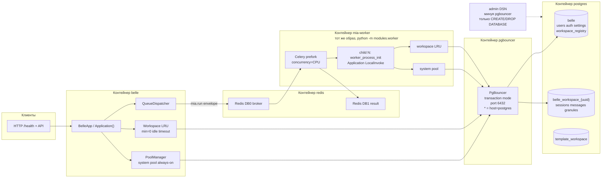
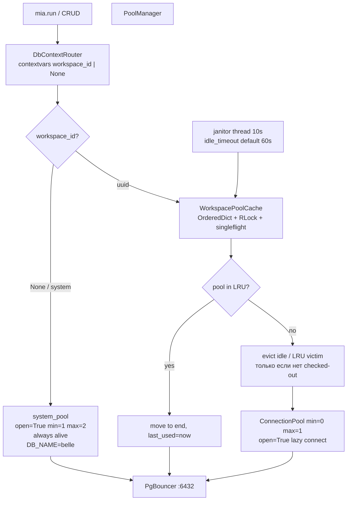

# План: динамические пулы системной и per-user БД (belle + mia-worker)

**Тип:** архитектура + фича  
**Сложность:** высокая  
**Проекты:** belle (`Dek1m/belle`), mia (`Dek1m/mia`), mia-db (`Dek1m/mia-db` → `/home/opencode/projects/mia/modules/db`), mia-worker (`Dek1m/mia-worker` → `/home/opencode/projects/mia/modules/worker`), mia-workspace, mia-auth  
**Рабочий файл плана:** `/home/opencode/projects/belle/plan.md`  
**Связанный ADR-004:** `docs/adr/ADR-004-schema-apply-once.md` — системные схемы накатывает one-shot `migrate` под `pg_advisory_lock` на admin-DSN; воркеры только Python + пулы. Не смешивать с `mia.run`.  
**Стандарты:**
- `docs/CODING_STANDARD.md` (ООП, инкапсуляция, без секретов в логах)
- `docs/DOCKER_COMPOSE_RULES.md` (сервисы, env, сети, лимиты)
- `docs/LOGGING_STANDARD.md` v2.0
- `docs/OBSERVABILITY_STANDARD.md` v1.0 (пулы, exhaustion)
- DATABASE / ARCHITECTURE как отдельные файлы в `docs/` — **не определены**. Контракт этой волны фиксируем ADR в belle (шаг 1). Обсудить с Афиной вынос в `docs/` после приёмки.

Поправка Мастера внесена: workspace — модуль, не ядро. Код начинаем после этой правки.

---

## 1. Цель и инварианты

### Цель

Убрать модель «один `ConnectionPool` → одна `DB_NAME`». Сделать так, чтобы belle и mia-worker обслуживали **тысячи** per-user БД `belle_workspace_{uuid}` без исчерпания `max_connections` PostgreSQL и без утечки пулов в prefork Celery.

### Что есть сейчас (факт из кода)

| Факт | Где |
|---|---|
| Один пул на одну БД, `open=True`, `min_size=DB_POOL_MIN` | `mia/modules/db/__init__.py` `DatabaseModule.on_load` |
| `DbContextRouter` в Python **нет** | grep по репо — 0 совпадений |
| SSL-поля есть в `DatabaseConfig`, в пул **не прокинуты** (`configure=None`, DSN без `sslmode`) | `modules/db/config.py`, `modules/db/__init__.py` |
| Воркер: тот же образ, `python -m modules.worker`, concurrency = CPU | `belle/docker-compose.yml`, `modules/worker/__main__.py` |
| Пул в воркере создаётся **после fork** через `worker_process_init` → `Application.load_all_modules()` | `core/dispatch/tasks.py` |
| Очередь Redis, задача `mia.run`, очередь `mia`. Импортов shaltir нет | `modules/worker/celery_app.py`, `dispatcher.py` |
| Остаток имени `ShaltirResultHandle` | `core/dispatch/handle.py` |
| Workspace-схема живёт в **той же** БД, FK на `auth.users` | `modules/workspace/schemas.py` |
| `workspace_registry` нет | — |
| PgBouncer в compose нет | `belle/docker-compose.yml` |
| Тестовый сервер `ai-t-01.atom.ui`, `~/app/{belle,postgres,redis}`, сеть `app-net`. Контейнер shaltir снят | память + текущий compose |

### Инварианты (нарушать нельзя)

1. **Системная БД `belle`:** users, auth, settings. Одна на инстанс. Системный пул **всегда живой**. Реестр workspace-БД — таблица **модуля workspace**, не ядра mia.
2. **Именованные БД** (имя задаёт модуль, не ядро): например `belle_workspace_{uuid}`. UUID в имени. **mia не знает слова workspace.**
3. **Пулы workspace — ленивые LRU + idle timeout.** Не открывать 1000 пулов на старте.
4. **Снаружи — PgBouncer `pool_mode=transaction`.** Приложение не ходит в postgres напрямую в runtime (исключение: admin-DSN для `CREATE DATABASE`).
5. **Каскад конфигов:** дефолты модуля → `MiaConfig` / `MIA_*` → belle/compose только важное. Compose не свалка.
6. **mia и belle не знают shaltir.** Очередь = Redis, исполнитель = mia-worker. Не возвращать shaltir.
7. **SSL к postgres живёт в mia-db** (`DB_SSL_MODE`, CA в образе belle). Воркер SSL **не дублирует**.
8. **Пулы создаются только после fork** Celery (`worker_process_init`). Parent не держит открытых соединений. На shutdown — закрыть все.
9. **Через PgBouncer transaction mode запрещены prepared statements** (`prepare_threshold=None`). `DatabaseConfig.prepared_statements` по умолчанию `False`.
10. **mia ядро не знает workspace.** Домен workspace/sessions/messages — только модуль `mia-workspace` (`state.workspace(...)`).
11. **mia-db** — фабрика именованных пулов: `get_pool(dbname)` / системный пул. Не знает user/ws/session.
12. **API модуля workspace (контракт Мастера):**
    - `state.workspace(user=uuid|User, ws=uuid)` → объект одного workspace
    - `state.workspace(user=...).list()` → JSON список workspace пользователя
    - `state.workspace(user=..., ws=...).sessions()` → JSON список сессий
    - `state.workspace(user=..., ws=...).sessions(session_uuid)` → JSON лента: сообщения + действия вперемешку
    - `user` можно передать как `state.auth.user('uuid')`
    - Единственная точка входа Python — класс Workspace. SQL, relations, хранимки, партиции `events` — внутри модуля, снаружи их нет.

### Поправка Мастера (обязательна)

Текущий `modules/workspace` кладёт схему в **ту же** БД и ходит в `WorkspaceProvider` через DI. Это неверно относительно контракта выше.

Разделение:

| Слой | Знает | Не знает |
|---|---|---|
| **mia core** | Application, модули, очередь Redis | workspace, сессии, user-БД |
| **mia-db** | DSN, SSL, LRU пулов по `dbname` | workspace, user, session |
| **mia-auth** | User, `state.auth.user(uuid)` | workspace |
| **mia-workspace** | user→dbname, CRUD ws/sessions/messages, `state.workspace(...)` | Celery, PgBouncer |

`CREATE DATABASE` вызывает workspace-модуль через db-модуль (`create_database(dbname)`), не ядро.

### Формула соединений (обязательна к соблюдению)

```
P     = belle_процессы + celery_concurrency          # 1 + CPU, на ai-t-01 ≈ 9
S_max = system pool max на процесс                   # дефолт 2
L     = LRU cap workspace-пулов на процесс           # дефолт 32
K     = max_size одного workspace-пула               # дефолт 1
C     = P * (S_max + L * K)                          # клиенты → PgBouncer
                                                     # 9 * (2 + 32) = 306

max_client_conn(PgBouncer) ≥ C * 1.5                 # → 1000
server_conns ≈ default_pool_size * (1 system + N_active_workspace_dbs)
postgres max_connections ≥ server_conns + 3 (superuser)
```

При 20 активных пользователях и `default_pool_size=5`: `20*5 + 20 ≈ 120` серверных соединений. При 1000 пользователях, но 20 активных — то же самое. LRU + idle timeout + `server_idle_timeout` держат хвост мёртвым.

---

## 2. Архитектура

### 2.1. Runtime



### 2.2. Системный пул vs workspace LRU



### 2.3. Контракт роутера

- `DbContextRouter.current() -> str | None` — `None` = системная БД.
- `use_workspace(uuid: UUID)` / `use_system()` — context manager на `contextvars`.
- `DatabaseProvider` **не** хранит «тот самый» пул как единственный. `provider._pool` для обратной совместимости = system pool. Методы, которым нужна user-data, берут пул через `PoolManager.get(router.current())`.
- Имя БД собирается только так: `f"belle_workspace_{uuid}"` после валидации `UUID`. Никакого username в идентификаторе.
- Envelope `TaskRequest` получает опциональное поле `workspace_id: str | None` (UUID, не PII, не в ciphertext — это routing metadata). `mia_run` ставит contextvar в `try/finally`.

### 2.4. Провижининг БД

- На создании пользователя (auth): запись в `workspace_registry` + `CREATE DATABASE belle_workspace_{uuid} TEMPLATE template_workspace`.
- `CREATE DATABASE` **нельзя** надёжно гонять через PgBouncer transaction mode → отдельный admin-коннект напрямую в postgres (`DB_ADMIN_HOST=postgres`, не в compose-свалке: дефолт модуля = `DB_HOST` если admin не задан, на проде задаём явно).
- Product `create_workspace` (папка/пространство внутри user-БД) **не** создаёт PostgreSQL database.

### 2.5. Celery × пулы

```
parent celery (не грузит db)
  fork × CPU
    child: worker_process_init
      Application(LocalInvoke, allowed_modules)
      DatabaseModule.on_load → PoolManager.start()  # pid-guard
      mia_run → router + LRU
    child: worker_process_shutdown / max_tasks_per_child
      PoolManager.close_all()  # system + все LRU
```

Pid-guard: у каждого пула запоминаем `pid`. Если `os.getpid() != pid` — не использовать, пересоздать. Это страховка от копирования fd при ошибочном open до fork.

---

## 3. Каскад конфигов

Порядок (последний побеждает), как уже сделано в `WorkerConfig`:

```
1. Дефолты модуля
2. MiaConfig / MIA_*
3. Belle / compose ENV — только важное
```

### 3.1. Модуль mia-db (`modules/db/config.py`) — дефолты и все рычаги пулов

| Поле | Дефолт | Зачем здесь |
|---|---|---|
| `host` | `localhost` | |
| `port` | `5432` | runtime сменится на 6432 через compose |
| `database` | `belle` | системная БД |
| `user` / `password` | `mia` / `""` | пароль только ENV |
| `pool_min` / `pool_max` | `1` / `2` | **системный** пул |
| `pool_timeout` | `30` | |
| `workspace_pool_min` | `0` | lazy |
| `workspace_pool_max` | `1` | мультиплекс на PgBouncer |
| `workspace_lru_size` | `32` | cap на процесс |
| `workspace_idle_timeout` | `60` | секунды |
| `workspace_db_prefix` | `belle_workspace_` | |
| `prepared_statements` | `False` | PgBouncer transaction |
| `ssl_mode` / `ssl_ca` / cert / key | как сейчас | **единственное** место SSL |
| `admin_host` / `admin_port` | `None` → fallback на host/port | только DDL CREATE/DROP DATABASE |
| `auto_migrate` | `False` | |

ENV модуля (не тащить в compose без нужды): `DB_POOL_MIN`, `DB_POOL_MAX`, `DB_WS_POOL_MIN`, `DB_WS_POOL_MAX`, `DB_WS_LRU_SIZE`, `DB_WS_IDLE_TIMEOUT`, `DB_SSL_MODE`, `DB_ADMIN_HOST`, `DB_ADMIN_PORT`.

Каскад как у `WorkerConfig.load()`: дефолт → `MiaConfig.get_value("db.*")` → `DB_*` / `BELLE_DB_*`.

### 3.2. MiaConfig / `MIA_*` (`core/config.py`)

Добавить в `_build_defaults` секцию `db` **только если** belle не задаёт (опциональный overlay, не дублировать SSL):

```
db.pool_min, db.pool_max,
db.workspace_pool_min, db.workspace_pool_max,
db.workspace_lru_size, db.workspace_idle_timeout
```

`MIA_DB_*` → `_ENV_TO_DOTPATH`. Worker-секция уже есть (`MIA_WORKER_*`). **Не** класть `DB_HOST`/`DB_PASSWORD` в MiaConfig — это деплой.

### 3.3. Belle / compose — только важное

Уже в `.env.example` + `docker-compose.yml`. Меняем минимум:

| Переменная | Значение на ai-t-01 | Почему в compose |
|---|---|---|
| `REDIS_HOST` / `REDIS_PORT` | `redis` / `6379` | сеть |
| `DB_HOST` | `pgbouncer` | смена точки входа |
| `DB_PORT` | `6432` | |
| `DB_NAME` | `belle` | системная |
| `DB_USER` / `DB_PASSWORD` | секреты | |
| `DB_SSL_MODE` | см. шаг Киры: либо `disable` до pgbouncer на `app-net`, либо `require` если pgbouncer client TLS | одно значение, читает mia-db |
| `DB_ADMIN_HOST` | `postgres` | обход pgbouncer для CREATE DATABASE |
| `DB_ADMIN_PORT` | `5432` | |
| `SERVICE_NAME` | `belle` / `mia-worker` | логи |
| `PYTHONPATH` | `/app/mia:/app` | |

**Не класть в compose:** `DB_POOL_*`, `DB_WS_*`, `WORKER_PREFETCH`, `WORKER_BROKER_DB`, `WORKER_CONCURRENCY` (пусто = CPU), SSL CA-пути (CA уже в образе).

### 3.4. PgBouncer (инфра, не belle-свалка)

Отдельный стек рядом с postgres (`~/app/postgres` или `~/app/pgbouncer`). В belle-compose — только `DB_HOST=pgbouncer`.

Ключевые параметры (дефолты файла, не ENV belle):

```
pool_mode = transaction
listen_port = 6432
max_client_conn = 1000
default_pool_size = 5
min_pool_size = 0
reserve_pool_size = 2
server_idle_timeout = 60
server_lifetime = 3600
query_wait_timeout = 30
ignore_startup_parameters = extra_float_digits,options
auth_type = scram-sha-256
[databases]
belle = host=postgres port=5432 dbname=belle
* = host=postgres port=5432
```

`*` обязателен: тысячи `belle_workspace_{uuid}` нельзя перечислять руками.

---

## 4. Пошаговый план

Зависимости: шаг N не начинать, пока не закрыт указанный predecessor. Параллелить можно только явно помеченные шаги.

### Шаг 1: ADR — пулы, роутер, PgBouncer, fork

- **Кто:** Эна (architect), ревью Нора
- **Сложность:** средняя
- **Файлы:** `belle/docs/adr/ADR-003-workspace-pools.md` (новый; путь согласовать с Афиной, если `docs/` в belle ещё нет — создать)
- **Зависимости:** —
- **Стандарт:** CODING_STANDARD §3 (инкапсуляция); зафиксировать инварианты §1 этого плана
- **Ожидаемый результат:** accepted ADR. Содержит: system vs LRU, формулу `C`, запрет prepared statements, admin-DSN, envelope `workspace_id`, pid-guard, «не возвращать shaltir». Без ADR Сона не пишет код.

### Шаг 2: Схема данных — system vs workspace, registry, template

- **Кто:** Нора (db-architect)
- **Сложность:** высокая
- **Файлы:**
  - `mia/modules/auth/schemas.py` — без изменений таблиц users (system)
  - `mia/modules/workspace/schemas.py` — убрать `REFERENCES auth.users(id)`; `owner_id`/`user_id` = UUID без cross-db FK
  - новый `mia/modules/db/schemas_registry.py` или `mia/modules/workspace/registry_schema.py` — таблица `workspace_registry` в **системной** БД (схема `belle` или `workspace_registry`): `id UUID PK`, `user_id UUID NOT NULL`, `db_name TEXT UNIQUE NOT NULL`, `status TEXT`, `created_at`, `dropped_at`
  - SQL template: `mia/modules/db/sql/template_workspace.sql` — объекты user-БД (sessions, messages, granules, product-workspaces без FK на auth)
- **Зависимости:** шаг 1
- **Ожидаемый результат:** два набора схем. Явная процедура: один раз создать `template_workspace`, дальше только `CREATE DATABASE ... TEMPLATE template_workspace`. Документ ограничений PostgreSQL: к template не должно быть открытых сессий в момент CREATE.

### Шаг 3: Сеть и SSL через PgBouncer (дизайн, без деплоя)

- **Кто:** Кира (networks) + Лита (security) параллельно Норе после шага 1
- **Сложность:** высокая
- **Файлы:** черновик в ADR-003 секция Network/TLS (Эна вносит текст Киры)
- **Зависимости:** шаг 1
- **Решение зафиксировать одно:**
  - **Рекомендация:** на `app-net` клиент belle/worker → pgbouncer **без TLS** (`DB_SSL_MODE=disable`), pgbouncer → postgres **с TLS** (`server_tls_sslmode=require`, CA как сейчас у postgres). SSL-поля остаются в mia-db; воркер их не знает.
  - Альтернатива (если Мастер настоит на TLS до pgbouncer): `client_tls_sslmode=require` + сертификат pgbouncer, `DB_SSL_MODE=require` без новых переменных в worker.
- **Ожидаемый результат:** выбранный путь записан в ADR. Список портов: postgres `5432` только для pgbouncer+admin, снаружи приложения `6432`.

### Шаг 4: `DatabaseConfig` — поля пулов, admin DSN, каскад, SSL в DSN

- **Кто:** Сона (programmer)
- **Сложность:** средняя
- **Файлы:** `mia/modules/db/config.py`
  - поля из §3.1
  - `load()` по образцу `modules/worker/config.py` (дефолт → MiaConfig `db.*` → `DB_*`)
  - `get_dsn(database: str | None = None) -> str` — `sslmode` в URI (`sslmode=require` и т.д.), **не** отдельный SSL-код в worker
  - `get_admin_dsn() -> str` — host/port admin, dbname=`postgres` или `belle` (для CREATE DATABASE нужен коннект не к target db)
  - `validate()`: `workspace_pool_max >= 1` если min=0 ок; `lru_size >= 1`; uuid-prefix без кавычек
- **Зависимости:** шаг 1
- **Стандарт:** CODING_STANDARD (пароль не в `public_dict` / логах)
- **Ожидаемый результат:** конфиг покрывает system+workspace+admin. SSL только здесь.

### Шаг 5: `PoolManager` + LRU + janitor + pid-guard

- **Кто:** Сона
- **Сложность:** высокая
- **Файлы (новые):**
  - `mia/modules/db/pool_manager.py`
    - `PoolManager.start()` — создаёт system `ConnectionPool(open=True, min_size=pool_min, max_size=pool_max, kwargs={prepare_threshold: None})`
    - `get_system() -> ConnectionPool`
    - `get_workspace(db_uuid: UUID) -> ConnectionPool` — LRU + singleflight
    - `close_all()` — close+wait system и всех LRU
    - pid-guard
  - `mia/modules/db/workspace_pool_cache.py`
    - `OrderedDict[str, _Entry]`, `threading.RLock`
    - `_Entry { pool, last_used, pid }`
    - evict: idle > timeout **или** overflow cap; **не** закрывать пул с checked-out (`pool.get_stats()` / не давать close пока `used > 0` — skip victim, взять следующего)
    - janitor: daemon thread interval 10s, останавливается в `close_all`
    - factory пула: `min_size=0`, `max_size=workspace_pool_max`, `open=True`, тот же `prepare_threshold=None`, тот же sslmode из `get_dsn(dbname)`
- **Зависимости:** шаг 4
- **Ожидаемый результат:** модуль, который можно покрыть моками без живого postgres. Никакого «открыть 1000 пулов на старте».

### Шаг 6: `DbContextRouter` + проводка в `DatabaseProvider`

- **Кто:** Сона
- **Сложность:** высокая
- **Файлы:**
  - новый `mia/modules/db/router.py` — `contextvars.ContextVar`, `use_system()`, `use_workspace(uuid)`, `current_db_name()`
  - `mia/modules/db/provider.py` — CRUD через `_active_pool()` = `PoolManager.get(router)`
  - `register_schema` / DDL tracker — **только system pool**, если не передан явный pool (миграции user-БД идут через template, не через register_schema на каждую БД в runtime)
  - `mia/modules/db/__init__.py` `on_load`/`on_unload` — `PoolManager` вместо голого `ConnectionPool`; `on_unload` → `close_all`
- **Зависимости:** шаг 5
- **Ожидаемый результат:** `state.db` по умолчанию пишет в `belle`. Внутри `with router.use_workspace(uid):` — в user-БД. Утечки контекста между задачами нет (`finally: reset`).

### Шаг 7: Envelope + `mia_run` + shutdown воркера

- **Кто:** Сона
- **Сложность:** средняя
- **Файлы:**
  - `mia/core/dispatch/envelope.py` — поле `workspace_id: str | None = None` в `TaskRequest.to_dict/from_dict`
  - `mia/modules/worker/dispatcher.py` `QueueDispatcher.dispatch_async` — прокинуть `workspace_id` из kwargs задачи / явного аргумента (не из ciphertext)
  - `mia/core/dispatch/tasks.py`:
    - в `mia_run`: `with DbContextRouter.use(...):` вокруг `target(*args)`
    - `@worker_process_shutdown.connect` → найти `DatabaseModule`/`PoolManager.close_all()`
    - pid в логах уже есть — добавить `workspace_id` в `mia_run_start` extra
  - `mia/core/dispatch/handle.py` — переименовать `ShaltirResultHandle` → `TaskResultHandle`, обновить импорты (`dispatcher.py` и тесты)
  - `mia/modules/worker/__main__.py` — не добавлять SSL; при необходимости `worker_process_shutdown` уже в tasks
- **Зависимости:** шаг 6
- **Ожидаемый результат:** задача несёт uuid воркспейса, воркер закрывает пулы на recycle (`max_tasks_per_child=1000`). Имени shaltir в runtime-коде нет.

### Шаг 8: Провижининг user-БД (auth + registry)

- **Кто:** Сона, контракт от Норы (шаг 2)
- **Сложность:** высокая
- **Файлы:**
  - новый `mia/modules/db/provisioner.py`
    - `provision(user_id: UUID) -> str` — admin connection (psycopg autocommit, **не** pgbouncer): `CREATE DATABASE belle_workspace_{uuid} TEMPLATE template_workspace`; insert `workspace_registry`
    - `drop(user_id)` — только явный вызов, не в этой волне по умолчанию, но метод с `REVOKE/DROP DATABASE` + status=dropped
    - валидация uuid, quote через `psycopg.sql.Identifier`
  - `mia/modules/auth/bootstrap.py` / место создания пользователя — вызов `provisioner.provision` **после** insert user (системный пул)
  - `mia/modules/workspace/provider.py` — `create_workspace` больше не думает про CREATE DATABASE; репозиторий ходит в user-БД через роутер
  - `mia/modules/workspace/repository.py` — все session/message запросы под `use_workspace`
- **Зависимости:** шаги 2 и 6
- **Ожидаемый результат:** новый пользователь = строка в registry + пустая user-БД из template. Повторный provision идемпотентен (если db_name уже в registry — не создавать).

### Шаг 9: MiaConfig overlay для `db.*`

- **Кто:** Сона
- **Сложность:** низкая
- **Файлы:** `mia/core/config.py` (`_build_defaults`, `_ENV_TO_DOTPATH`, `_NUMERIC_KEYS`), `mia/examples/mia.json5.example`
- **Зависимости:** шаг 4
- **Ожидаемый результат:** `MIA_DB_WS_LRU_SIZE` и аналоги работают. Хост/пароль/SSL в MiaConfig **нет**.

### Шаг 10: Compose belle — точка входа pgbouncer, без свалки

- **Кто:** Рэй (devops)
- **Сложность:** средняя
- **Файлы:**
  - `belle/docker-compose.yml` — `DB_HOST`/`DB_PORT` не хардкодить, они из `.env`; `depends_on` не навязывает postgres-сервис внутри belle-файла если postgres внешний (сейчас `depends_on: postgres` — **починить**: либо внешний compose с сервисом `pgbouncer` в `app-net`, либо `depends_on: pgbouncer`)
  - `belle/.env.example` — таблица из §3.3
  - **не** добавлять service pgbouncer в belle-compose, если postgres живёт в `~/app/postgres` — pgbouncer рядом с postgres (шаг 11)
- **Зависимости:** шаг 3 (решение TLS)
- **Стандарт:** `docs/DOCKER_COMPOSE_RULES.md` §3 (имена, env_file, лимиты, logging json-file)
- **Ожидаемый результат:** belle и worker получают 5–7 DB_* переменных. Пулы/LRU в compose отсутствуют.

### Шаг 11: PgBouncer на ai-t-01 + postgres `max_connections`

- **Кто:** Рэй, сеть Кира, лимиты Нора
- **Сложность:** высокая
- **Файлы (сервер, не belle repo):** `~/app/pgbouncer/docker-compose.yml`, `pgbouncer.ini`, `userlist.txt` (секреты не в git), сеть `app-net`
- **Зависимости:** шаги 3 и 10
- **Сделать:**
  - контейнер `pgbouncer` в `app-net`, DNS-имя `pgbouncer`
  - `*` database stanza
  - `max_client_conn=1000`
  - postgres: поднять `max_connections` (Нора считает по формуле; для ai-t-01 старт **200**, не 100; запас superuser)
  - admin путь: `postgres:5432` доступен belle/worker **только** для provisioner (не для CRUD)
  - healthcheck pgbouncer
- **Ожидаемый результат:** с контейнера belle `psql`/`python` на `pgbouncer:6432` видит `belle`; `CREATE DATABASE` на `postgres:5432` проходит; CRUD через 6432.

### Шаг 12: Метрики и логи пулов

- **Кто:** Мая (observability)
- **Сложность:** средняя
- **Файлы:** `pool_manager.py` / `workspace_pool_cache.py` (точки, которые Сона оставляет), логи по `LOGGING_STANDARD.md`
- **Зависимости:** шаг 5 (контракт с Соной: методы `stats()`)
- **Метрики (имена согласовать с OBSERVABILITY_STANDARD, префикс `mia_db_`):**
  - `mia_db_pool_size{kind=system|workspace,db=...}` — не кардиналити 1000 лейблов `db`. Для workspace: **без** db-label, только `kind=workspace`, плюс gauge `mia_db_workspace_pools_cached`, `mia_db_workspace_pools_evicted_total`, `mia_db_pool_acquire_wait_seconds`, `mia_db_pool_exhausted_total`
  - Алерт: `ConnectionPoolExhausted`, рост `evicted` + wait
- **Логи:** `pool_created`, `pool_evicted`, `pool_closed`, `provision_ok` — без паролей, без ciphertext. `workspace_id` можно.
- **Ожидаемый результат:** по логам видно LRU hit/evict; prometheus-клиент не взрывается кардиналити.

### Шаг 13: Тесты

- **Кто:** Катерина (tester)
- **Сложность:** высокая
- **Файлы (новые):**
  - `mia/modules/db/tests/test_pool_manager.py` — LRU cap, idle evict, skip busy victim, pid-guard, close_all
  - `mia/modules/db/tests/test_router.py` — вложенность, reset в finally, default=system
  - `mia/modules/db/tests/test_config_cascade.py` — дефолт < MiaConfig < DB_*
  - `mia/modules/db/tests/test_provisioner.py` — uuid-only имена, Identifier, идемпотентность (моки)
  - `mia/core/dispatch/tests/test_envelope_workspace.py` — roundtrip workspace_id
  - `mia/modules/workspace/tests/test_no_cross_db_fk.py` — в schema нет `REFERENCES auth.`
  - интеграция (skip если нет postgres): два dbname, роутер переключает, system жив после evict workspace
- **Зависимости:** шаги 5–8
- **Как проверить:** `pytest modules/db/tests/ modules/workspace/tests/ core/dispatch/tests/ -v`
- **Ожидаемый результат:** unit без живого PG зелёные. Интеграция skippable. Нет теста «открыть 1000 реальных пулов» в CI — вместо этого мок cap=8 и overflow.

### Шаг 14: Security review

- **Кто:** Лита
- **Сложность:** средняя
- **Файлы:** provisioner, router, DSN, логи, pgbouncer userlist, права роли `belle`
- **Зависимости:** шаги 8 и 11 (можно черновик после 6)
- **Проверить:**
  - имя БД только из UUID
  - роль приложения: `CONNECT` на user-БД, без `CREATEDB` (CREATEDB только admin-роль provisioner)
  - секреты не в логах / `public_dict`
  - через pgbouncer нельзя сделать `COPY PROGRAM` и т.п. сверх обычного CRUD (роль без SUPERUSER)
  - admin-DSN не светится в worker-конфиге публично
- **Ожидаемый результат:** список дыр = 0 блокеров, либо патч Соне.

### Шаг 15: Деплой на ai-t-01 и проверка

- **Кто:** Рэй, дым Катерина
- **Сложность:** средняя
- **Куда:** `ai-t-01.atom.ui`, `~/app/{belle,postgres,redis,pgbouncer}`, сеть `app-net`
- **Зависимости:** шаги 10, 11, 13 (unit), 7 (образ: Dockerfile клонит mia-db/mia-worker с GitHub — после мержа тегов)
- **Сделать:**
  - shaltir не поднимать (контейнер уже снят)
  - пересобрать образ belle (`CACHEBUST`)
  - worker: `python -m modules.worker`, логи `worker_process_init` / `mia_worker_ready` на каждый PID
  - создать тестового пользователя → в postgres список БД появляется `belle_workspace_{uuid}`
  - CRUD сессии идёт не в `belle`, а в user-БД
  - `pg_stat_activity` / pgbouncer `SHOW POOLS` — нет 1 пула на каждого юзера навсегда; после idle пулы схлопываются
- **Ожидаемый результат:** belle healthy, mia-worker healthy, shaltir нет, две БД на одного тестового юзера (system+workspace).

### Шаг 16: Документация

- **Кто:** Тиамат (tech-writer)
- **Сложность:** низкая
- **Файлы:** ADR-003 в финальном виде, `mia/modules/db/README.md` (сейчас врёт про asyncpg — поправить), короткий runbook в belle README: кто куда коннектится
- **Зависимости:** шаг 15
- **Ожидаемый результат:** README mia-db описывает PoolManager/LRU/PgBouncer. Про shaltir ни слова как про действующий компонент.

---

### Итого по шагам

| # | Что | Кто | Сложность | Зависит от |
|---|---|---|---|---|
| 1 | ADR пулы/роутер/fork | Эна (+Нора) | средняя | — |
| 2 | Схемы + template + registry | Нора | высокая | 1 |
| 3 | TLS/сеть pgbouncer | Кира + Лита | высокая | 1 |
| 4 | DatabaseConfig каскад + SSL в DSN | Сона | средняя | 1 |
| 5 | PoolManager + LRU | Сона | высокая | 4 |
| 6 | DbContextRouter + Provider | Сона | высокая | 5 |
| 7 | Envelope + mia_run + shutdown + rename handle | Сона | средняя | 6 |
| 8 | Provisioner + auth/workspace | Сона | высокая | 2, 6 |
| 9 | MiaConfig `db.*` | Сона | низкая | 4 |
| 10 | belle compose/.env | Рэй | средняя | 3 |
| 11 | PgBouncer + max_connections | Рэй + Кира + Нора | высокая | 3, 10 |
| 12 | Метрики/логи пулов | Мая | средняя | 5 |
| 13 | Тесты | Катерина | высокая | 5–8 |
| 14 | Security review | Лита | средняя | 8, 11 |
| 15 | Деплой ai-t-01 | Рэй + Катерина | средняя | 7, 10, 11, 13 |
| 16 | README/ADR | Тиамат | низкая | 15 |

- Шагов: 16  
- Новых файлов (ориентир): ~10 python в mia-db + 1 ADR + pgbouncer compose на сервере  
- Сложность волны: **высокая**  
- Время: ~3–4 рабочих дня после ADR (Сона 1.5–2д, Рэй/Кира 0.5–1д, Катерина 1д, параллель Нора/Лита/Мая)

Параллель после шага 1: Нора(2) ∥ Кира/Лита(3) ∥ Сона(4). Сона 5→6→7 строго. 9 параллельно 5. 12 параллельно 6–8. 10 после 3.

---

## 5. Риски

### 5.1. `max_connections` PostgreSQL

- **Риск:** LRU cap × fork × pool_max съедает лимит. 8 воркеров × 32 × 1 + system = сотни клиентских; если **забыть** PgBouncer и ткнуть в postgres — смерть за минуты.
- **Митигация:** CRUD только через 6432; формула в ADR; `max_connections` считает Нора; алерт Маи; на ai-t-01 сначала 200, не 10000.

### 5.2. Fork Celery × пулы

- **Риск:** пул открыт в parent → дети делят fd → «another command is already in progress» / SSL state corruption.
- **Митигация:** сейчас db грузится в `worker_process_init` (хорошо). Запретить `open=True` до fork. Pid-guard. `worker_process_shutdown` + `max_tasks_per_child`. Не шарить `PoolManager` singleton между процессами через memory.

### 5.3. SSL через PgBouncer

- **Риск:** сейчас клиент ждёт `verify-full` к `postgres.atom.ui`. PgBouncer на `app-net` без client TLS сломает `sslmode=require`. Двойной TLS (клиент↔pgbouncer↔postgres) легко сломать CA.
- **Митигация:** шаг 3 выбирает **один** путь. SSL-код не копировать в worker. CA по-прежнему в образе belle (`certs/argentaca.crt`). Не ставить `sslmode=prefer` молча (уже обжигались: prefer→ssl=True при сервере без SSL).

### 5.4. Утечка пулов

- **Риск:** janitor не закрывает busy; overflow skip всех victims → LRU растёт безлимитно; исключение в `close()` оставляет пул в dict; recycle воркера без shutdown.
- **Митигация:** жёсткий cap: если некого выселить — **не** создавать 33-й, ждать timeout/ошибка `PoolCacheFull` → Celery retry. `close_all` в `finally` shutdown. Тесты Катерины на skip-busy + overflow. Метрика `workspace_pools_cached`.

### 5.5. `CREATE DATABASE` через transaction pooling

- **Риск:** PgBouncer рвёт/оборачивает, template locked, имя БД не появляется в `*`.
- **Митигация:** admin-DSN в обход pgbouncer, autocommit, не держать коннекты к `template_workspace`. После CREATE — первая работа через pgbouncer (новый dbname, stanza `*`).

### 5.6. Prepared statements / session state

- **Риск:** `prepared_statements=True` в текущем конфиге, psycopg3 по умолчанию prepare. В transaction mode — ошибки `prepared statement already exists` / не те данные.
- **Митигация:** `prepare_threshold=None` на **всех** пулах. Не использовать temp tables и `LISTEN` в CRUD.

### 5.7. Cross-db FK и текущая workspace-схема

- **Риск:** `REFERENCES auth.users` в `modules/workspace/schemas.py` невозможен между БД. Если забыть — register_schema падает или создаёт мёртвые FK.
- **Митигация:** шаг 2 обязателен до шага 8. Тест «в schema нет REFERENCES auth».

### 5.8. Кардиналити метрик

- **Риск:** лейбл `db=belle_workspace_{uuid}` = тысячи time series.
- **Митигация:** шаг 12 — агрегаты, без per-db label.

### 5.9. Права роли vs provisioner

- **Риск:** дать `belle` CREATEDB «чтобы проще» — любой SQL injection в идентификаторе = создание БД.
- **Митигация:** две роли. CRUD-роль без CREATEDB. Admin только в provisioner.

### 5.10. Dockerfile клонирует GitHub

- **Риск:** локальные правки mia-db не попадут на ai-t-01, пока нет push/tag.
- **Митигация:** порядок мержа: mia-db → mia (envelope/tasks) → mia-worker (если только re-export) → belle образ `CACHEBUST`. Рэй не деплоит с полусобранными репо.

---

## 6. Критерии готовности

1. В процессе belle и в каждом child mia-worker есть **один** живой system pool на `belle` и **ноль** workspace-пулов сразу после старта.
2. После запроса с `workspace_id` появляется не более одного пула на эту БД на процесс; после idle timeout пул закрыт (метрика/лог `pool_evicted`).
3. При LRU overflow новый пул либо вытесняет idle, либо получает ошибку — **не** растёт безлимитно.
4. `CREATE DATABASE` идёт в `postgres:5432`; SELECT/INSERT сессий — в `pgbouncer:6432` в `belle_workspace_{uuid}`.
5. `pg_stat_activity` на postgres при 50 последовательных разных uuid и 1 активном не держит 50 серверных коннектов спустя `server_idle_timeout`.
6. Celery `--concurrency=$(nproc)`: после `max_tasks_per_child` нет «зависших» коннектов от старого PID.
7. SSL не описан в worker-конфиге. `grep SSL modules/worker` = 0.
8. `grep -ri shaltir` в mia/belle (кроме changelog/ADR «удалён») = 0 в runtime. Класс `TaskResultHandle`.
9. Compose belle не содержит `DB_WS_LRU_SIZE` / pool knobs.
10. Unit Катерины зелёные. На ai-t-01: health belle + worker, тестовый user → вторая БД, shaltir-контейнера нет.
11. Prepared statements выключены; нет ошибок PgBouncer про prepared statement.
12. Лита: имя БД только UUID; CREATEDB не у CRUD-роли.

---

## 7. Что НЕ делаем в этой волне

- Не возвращаем shaltir (репо, контейнер, импорты, брокер-обёртка).
- Не пишем код «заодно» с планом.
- Не дублируем SSL в mia-worker.
- Не кладём все рычаги пулов в `docker-compose.yml`.
- Не per-user PostgreSQL roles / RLS вместо отдельных БД.
- Не read-replicas (`read_replicas` в конфиге не включать).
- Не asyncpg, не event loop в db.
- Не Flower, не полный Grafana-стек (только точки метрик в коде).
- Не DROP DATABASE на удаление пользователя в автомате (метод можно набросать, крючок — следующая волна).
- Не миграция исторических данных (сейчас всё в одной БД: отдельный план ETL, если на ai-t-01 уже есть sessions в `belle`).
- Не K8s, не горизонтальные реплики worker.
- Не Qdrant / эмбеддинги / granules-вектора.
- Не смена Celery на threads/gevent (prefork остаётся).
- Не `pool_mode=session` «чтобы prepared работали».
- Не предсоздание пулов для всех строк `workspace_registry` на старте.
- Не правки чужих репо вне цепочки mia-db → mia → mia-worker → belle.

---

## Порядок вызова команды (для Афины)

1. Эна — ADR (шаг 1).  
2. Параллельно: Нора (шаг 2), Кира+Лита (шаг 3).  
3. Сона — 4 → 5 → 6 → 7 → 8, шаг 9 параллельно с 5.  
4. Мая — контракт `stats()` со шагом 5, реализация 12.  
5. Рэй — 10, затем 11 с Кирой/Норой.  
6. Катерина — 13 по готовности 5–8.  
7. Лита — 14.  
8. Рэй+Катерина — 15.  
9. Тиамат — 16.
)